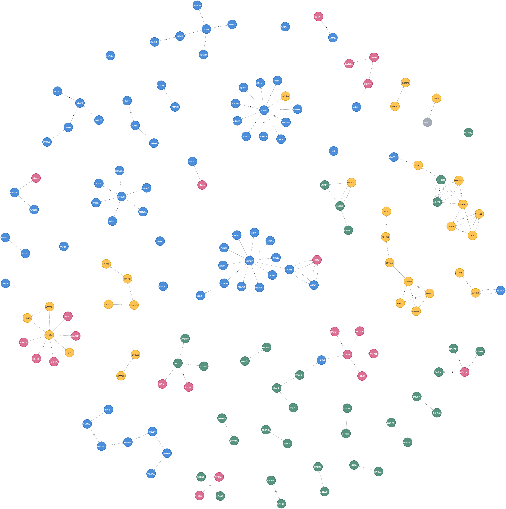

## KG-RAG for ARCH

  

### 这个项目通过大语言模型抽取建筑规范的关系，并将其写入neo4j数据库后进行查询

本项目主要实现基于Neo4j的建筑规范文本RAG，具体分为以下两个阶段：

    一、知识提取及写入
        1、知识提取：识别建筑规范文本中的实体与实体之间的关系
        2、知识写入：将识别的关系进行合并等处理，写入Neo4j图数据库
    二、识别及知识召回
        1、实体识别：识别用户问题中的实体，将其与已存在的实体做匹配
        2、知识召回：召回已识别的实体及相应关系，构建查询语句
        3、问题查询：结合召回的知识，构建prompt进行大语言模型的问题查询

    目前大语言模型使用deepseek
    neo4j前端页面：124.220.108.101:7474/browser/

#### 文件

    asset： 原始规范文本储存数据
    cached：抽取关系的本地缓存数据
    config：配置文件
    database：neo4j数据库相关操作
    entity：实体及关系的持有类
    llm：大语言模型调用
    pipeline：各阶段的pipeline

        process_write_to_neo4j.py： 写入数据的入口
        process_search.py： 召回搜素的入口

    prompt：各阶段调用的prompt
    utils：共用数据处理

### 运行

    一、配置参数
        1、大语言模型的key（目前支持deepseek）：config/config.yaml/llm_api_key
        2、配置neo4j的地址、账户：config/config.yaml/database
        3、配置知识解析的文本切块大小（chunk），以及获取的节点分类名称：config/config.yaml/knowledge_extract
        4、配置大语言模型访问的token限制数：config/config.yaml/token_limit
        5、配置搜索的相关性分数阈值（0-10）：config/config.yaml/node_threshold_value
    二、运行
        webui：python webui.py
        代码：python main.py

### TODO
    1、知识召回后，与问题进行rerank排序，选取与用户问题相关性最大的答案

